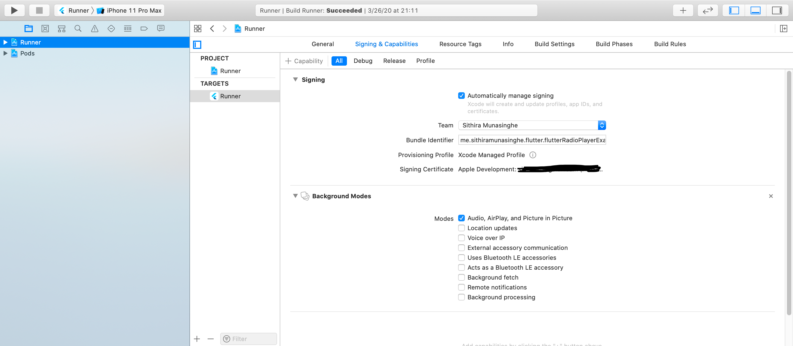

# flutter_radio_player


The only player if you need to play one streaming URL at a time. Flutter Radio Player supports playing a single source
precisely. By default, plugin supports background music playing by default. No additional configurations needed.
Flutter radio player effortlessly integrates with platform native media controls enabling lock screen controling
of the playing media as well <strong>integrates with iOS watchOS, CarPlay and Android's WearOS, Android Auto without any
configuration </strong>
all with the help of Flutter Radio Player's native platform integrations.

## Features

* Supports background playing with zero configurations out of the box
* Integrates with platform native watch interfaces like WatchOs and WearOs
* Integrates well with platform native AutoMotive infotainment system such as Apple CarPlay and Android Auto
* Reactive by default
* Extracts Icy / Meta data from streams (if available)

### Getting Started with Flutter Radio Player

1. Install the player

```bash
flutter pub add flutter_radio_player
```

2. Import the library

```dart
import 'package:flutter_radio_player/flutter_radio_player.dart';
```

3. Configuring the player

```
    final _flutterRadioPlayerPlugin = FlutterRadioPlayer(); // create an instance of the player
    _flutterRadioPlayerPlugin.initialize(
      [
            {
                "url": "https://s2-webradio.antenne.de/chillout?icy=https",
            },
            {
                "title": "SunFM - Sri Lanka",
                "artwork": "images/sample-cover.jpg", // needs be bundled with the app
                "url":
                "https://radio.lotustechnologieslk.net:2020/stream/sunfmgarden?icy=https",
            },
            {
                "url": "http://stream.riverradio.com:8000/wcvofm.aac"
            }
      ],
      true, // auto play on load
    );
```

once you have the basic player setup you are ready to stream music

### Manipulating the player

To manipulate the player, you have below methods available

#### Available methods list

| Method                 | Action                                                      |
|------------------------|-------------------------------------------------------------|
| play()                 | Plays the audio item in the queue                           |
| pause()                | Pauses the audio                                            |
| playOrPause()          | Toggle the player playback                                  |
| changeVolume()         | Change the volume in the player instance                    |
| getVolume()            | Get the current volume                                      |
| nextSource()           | Advance to the next audio source in the list (if available) |
| previousSource()       | Previous audio source                                       |
| jumpToSourceIndex(int) | Jumps to the provided index from the sources array          |

#### Available streams list

| Method                         | Returns                             | Action                                               |
|--------------------------------|-------------------------------------|------------------------------------------------------|
| getIsPlayingStream()           | stream of boolean                   | Returns the playback status as stream                |
| getNowPlayingStream()          | stream NowPlayingDataChanged Object | Return the now playing source ICY or Meta track name |
| getDeviceVolumeChangedStream() | stream of float                     | Device audio level stepper values                    |

### Platform Configurations

- iOS
  For iOS, You have to enable background capabilities like shown in the below image
  


- Android
  For newer android, add below permissions to play audio in background in `AndroidManifest.xml`. This is already added
  to library
  ```xml
      <uses-permission android:name="android.permission.INTERNET" />
      <uses-permission android:name="android.permission.FOREGROUND_SERVICE" />
      <uses-permission android:name="android.permission.FOREGROUND_SERVICE_MEDIA_PLAYBACK" />
  ```

**Be sure to check out the [Flutter Radio Player Example](/example) to get an idea of how to use action methods and
streams to create a simple yet powerful player**

## Support this plugin

Please hit a like to plugin on pub if you used it and love it. put a ⭐️ my
GitHub [repo](https://github.com/Sithira/FlutterRadioPlayer) and show me some ♥️ so i can keep working on this.

and last but not least, ONLY if you think this was worth it and saved you time here is my USDT-TR20 address so you can
buy me a coffee ☕️

``
TNuTkL1ZJGu2xntmtzHzSiH5YdVqUeAujr
``

**ENJOY THE PLUGIN** <br />
Sithira ✌️
